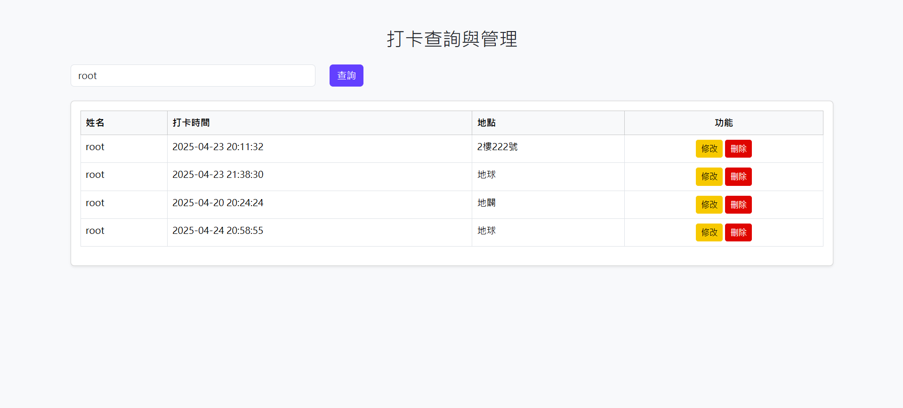

# 🕘 Punch Demo 打卡系統實作（Spring Boot）

這是一個使用 Spring Boot 打造的打卡系統，整合了後端渲染（Thymeleaf）、Spring Security 登入機制與 RESTful API，提供基本的帳號管理、區分一般使用者和管理員功能與打卡紀錄增刪改查功能。

## 🚀 技術棧（Tech Stack）

- **Java 21**
- **Spring Boot 3.2.5**
  - `spring-boot-starter-web` - 提供 Web 與 RESTful API 支援
  - `spring-boot-starter-thymeleaf` - 前端模板引擎（後端渲染）
  - `spring-boot-starter-security` - 登入驗證與角色授權機制
  - `spring-boot-starter-data-jpa` - 整合 JPA 進行 ORM 與資料操作
  - `spring-boot-starter-jdbc` - 資料庫連線支援
  - `spring-boot-starter-aop` - AOP 切面編程
- **MySQL** - 資料儲存
- **Lombok** - 簡化程式碼撰寫(目前暫無使用，想純手工瞭解為甚麼)
- **Bootstrap 5** - 頁面樣式與響應式 UI
- **Git** - 版本控制

---

## 功能畫面

### 登入頁面

### 註冊頁面

### 打卡系統

### 打卡紀錄更新

---

## 🔐 功能介紹

### ✅ 使用者登入 / 註冊
- Spring Security 驗證機制
- 使用資料庫帳號比對
- 成功登入導向 Dashboard

### 🛠 帳號管理（管理員）
- 建立 / 修改 / 刪除使用者介面
- 設定角色（USER / ADMIN）

### 🕒 打卡紀錄管理
- RESTful API 設計 方便用於APP或有前後端分離的使用者
- 支援查詢、建立、修改、刪除打卡紀錄

### 💻 Thymeleaf 模板引擎
- 後端渲染頁面：登入頁、註冊頁、打卡紀錄列表

---

## 學習歷程
* Java SE 的組成概念圖
* 複習JAVA物件導向特性
* 加強Annotation和Thread的本質
* Jave EE Servlet
* Spring MVC的核心 Dispatcher Servlet
* Spring Boot常用註解
## 實踐專案過程:
大致架構:建立資料庫+登入系統+打卡系統+畫面呈現

